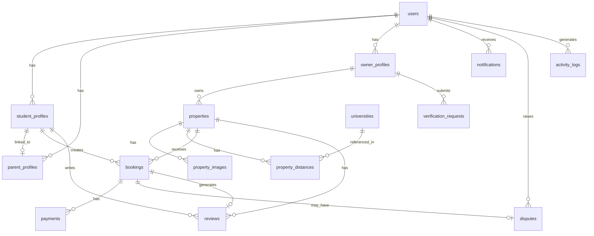

# SafeStay Database Schema - Detailed Documentation

## Overview

This document provides a comprehensive database schema for the SafeStay platform using PostgreSQL as the primary database and MongoDB for specific use cases.

---

## PostgreSQL Schema

### Entity Relationship Diagram



---

## Table Definitions with SQL

### 1. Users Table

```sql
CREATE TYPE user_role AS ENUM ('student', 'owner', 'admin', 'parent');

CREATE TABLE users (
    id UUID PRIMARY KEY DEFAULT gen_random_uuid(),
    email VARCHAR(255) UNIQUE NOT NULL,
    phone VARCHAR(20) UNIQUE NOT NULL,
    password_hash VARCHAR(255) NOT NULL,
    role user_role NOT NULL,
    first_name VARCHAR(100) NOT NULL,
    last_name VARCHAR(100) NOT NULL,
    avatar_url TEXT,
    is_email_verified BOOLEAN DEFAULT FALSE,
    is_phone_verified BOOLEAN DEFAULT FALSE,
    is_active BOOLEAN DEFAULT TRUE,
    last_login_at TIMESTAMP WITH TIME ZONE,
    created_at TIMESTAMP WITH TIME ZONE DEFAULT CURRENT_TIMESTAMP,
    updated_at TIMESTAMP WITH TIME ZONE DEFAULT CURRENT_TIMESTAMP
);

CREATE INDEX idx_users_email ON users(email);
CREATE INDEX idx_users_phone ON users(phone);
CREATE INDEX idx_users_role ON users(role);
```

### 2. Student Profiles Table

```sql
CREATE TYPE gender_type AS ENUM ('male', 'female', 'prefer_not_to_say');

CREATE TABLE student_profiles (
    id UUID PRIMARY KEY DEFAULT gen_random_uuid(),
    user_id UUID UNIQUE NOT NULL REFERENCES users(id) ON DELETE CASCADE,
    university VARCHAR(255),
    student_id VARCHAR(100),
    student_id_verified BOOLEAN DEFAULT FALSE,
    gender gender_type,
    date_of_birth DATE,
    governorate VARCHAR(100),
    nationality VARCHAR(100) DEFAULT 'Egyptian',
    preferences JSONB DEFAULT '{}',
    -- preferences structure: {
    --   "budget_min": 1000,
    --   "budget_max": 3000,
    --   "preferred_areas": ["Nasr City", "Maadi"],
    --   "max_distance_km": 10,
    --   "gender_preference": "female_only",
    --   "amenities": ["wifi", "parking"]
    -- }
    parent_id UUID REFERENCES parent_profiles(id),
    created_at TIMESTAMP WITH TIME ZONE DEFAULT CURRENT_TIMESTAMP,
    updated_at TIMESTAMP WITH TIME ZONE DEFAULT CURRENT_TIMESTAMP
);

CREATE INDEX idx_student_user ON student_profiles(user_id);
CREATE INDEX idx_student_university ON student_profiles(university);
```

### 3. Parent Profiles Table

```sql
CREATE TYPE relation_type AS ENUM ('father', 'mother', 'guardian', 'other');

CREATE TABLE parent_profiles (
    id UUID PRIMARY KEY DEFAULT gen_random_uuid(),
    user_id UUID UNIQUE NOT NULL REFERENCES users(id) ON DELETE CASCADE,
    relation_to_student relation_type,
    national_id VARCHAR(14),
    linked_students UUID[] DEFAULT ARRAY[]::UUID[],
    created_at TIMESTAMP WITH TIME ZONE DEFAULT CURRENT_TIMESTAMP,
    updated_at TIMESTAMP WITH TIME ZONE DEFAULT CURRENT_TIMESTAMP
);

CREATE INDEX idx_parent_user ON parent_profiles(user_id);
```

### 4. Owner Profiles Table

```sql
CREATE TYPE owner_type AS ENUM ('individual', 'company', 'property_management');

CREATE TABLE owner_profiles (
    id UUID PRIMARY KEY DEFAULT gen_random_uuid(),
    user_id UUID UNIQUE NOT NULL REFERENCES users(id) ON DELETE CASCADE,
    owner_type owner_type NOT NULL,
    national_id VARCHAR(14),
    national_id_verified BOOLEAN DEFAULT FALSE,
    business_license VARCHAR(100),
    business_license_verified BOOLEAN DEFAULT FALSE,
    tax_id VARCHAR(50),
    bank_account_number VARCHAR(50),
    bank_name VARCHAR(100),
    bank_branch VARCHAR(100),
    properties_count INTEGER DEFAULT 0,
    average_rating DECIMAL(3,2) DEFAULT 0,
    created_at TIMESTAMP WITH TIME ZONE DEFAULT CURRENT_TIMESTAMP,
    updated_at TIMESTAMP WITH TIME ZONE DEFAULT CURRENT_TIMESTAMP
);

CREATE INDEX idx_owner_user ON owner_profiles(user_id);
```

### 5. Properties Table

```sql
CREATE TYPE property_type AS ENUM ('apartment', 'room', 'shared_room', 'studio', 'villa');
CREATE TYPE gender_restriction AS ENUM ('male_only', 'female_only', 'mixed');
CREATE TYPE verification_status AS ENUM ('pending', 'approved', 'rejected', 'suspended');

CREATE TABLE properties (
    id UUID PRIMARY KEY DEFAULT gen_random_uuid(),
    owner_id UUID NOT NULL REFERENCES owner_profiles(id) ON DELETE CASCADE,
    title VARCHAR(200) NOT NULL,
    description TEXT,
    property_type property_type NOT NULL,
    
    -- Address fields
    address TEXT NOT NULL,
    governorate VARCHAR(100) NOT NULL,
    city VARCHAR(100) NOT NULL,
    district VARCHAR(100),
    postal_code VARCHAR(10),
    latitude DECIMAL(10, 8),
    longitude DECIMAL(11, 8),
    
    -- Pricing
    price_per_month DECIMAL(10, 2) NOT NULL,
    deposit_amount DECIMAL(10, 2) NOT NULL,
    service_fee DECIMAL(10, 2) DEFAULT 0,
    
    -- Availability
    available_from DATE,
    is_available BOOLEAN DEFAULT TRUE,
    gender_restriction gender_restriction,
    
    -- Property details
    max_occupants INTEGER DEFAULT 1,
    current_occupants INTEGER DEFAULT 0,
    bedrooms INTEGER DEFAULT 0,
    bathrooms INTEGER DEFAULT 0,
    area_sqm DECIMAL(8, 2),
    floor_number INTEGER,
    total_floors INTEGER,
    
    -- Features
    amenities JSONB DEFAULT '[]',
    -- amenities: ["wifi", "parking", "air_conditioning", "furnished", "washing_machine", "kitchen", "balcony", "elevator", "security"]
    
    utilities_included JSONB DEFAULT '[]',
    -- utilities: ["electricity", "water", "gas", "internet"]
    
    house_rules TEXT,
    
    -- Verification
    verification_status verification_status DEFAULT 'pending',
    verification_notes TEXT,
    verified_at TIMESTAMP WITH TIME ZONE,
    verified_by UUID REFERENCES users(id),
    
    -- Stats
    view_count INTEGER DEFAULT 0,
    favorite_count INTEGER DEFAULT 0,
    booking_count INTEGER DEFAULT 0,
    average_rating DECIMAL(3,2) DEFAULT 0,
    review_count INTEGER DEFAULT 0,
    
    -- Metadata
    is_featured BOOLEAN DEFAULT FALSE,
    featured_until TIMESTAMP WITH TIME ZONE,
    created_at TIMESTAMP WITH TIME ZONE DEFAULT CURRENT_TIMESTAMP,
    updated_at TIMESTAMP WITH TIME ZONE DEFAULT CURRENT_TIMESTAMP
);

CREATE INDEX idx_properties_owner ON properties(owner_id);
CREATE INDEX idx_properties_location ON properties(governorate, city);
CREATE INDEX idx_properties_price ON properties(price_per_month);
CREATE INDEX idx_properties_available ON properties(is_available);
CREATE INDEX idx_properties_verification ON properties(verification_status);
CREATE INDEX idx_properties_coords ON properties(latitude, longitude);
```

### 6. Property Images Table

```sql
CREATE TABLE property_images (
    id UUID PRIMARY KEY DEFAULT gen_random_uuid(),
    property_id UUID NOT NULL REFERENCES properties(id) ON DELETE CASCADE,
    image_url TEXT NOT NULL,
    thumbnail_url TEXT,
    is_primary BOOLEAN DEFAULT FALSE,
    display_order INTEGER DEFAULT 0,
    caption VARCHAR(255),
    uploaded_at TIMESTAMP WITH TIME ZONE DEFAULT CURRENT_TIMESTAMP
);

CREATE INDEX idx_property_images_property ON property_images(property_id);
CREATE INDEX idx_property_images_order ON property_images(property_id, display_order);
```

### 7. Universities Table

```sql
CREATE TABLE universities (
    id UUID PRIMARY KEY DEFAULT gen_random_uuid(),
    name VARCHAR(255) NOT NULL,
    name_ar VARCHAR(255),
    governorate VARCHAR(100) NOT NULL,
    city VARCHAR(100) NOT NULL,
    address TEXT,
    latitude DECIMAL(10, 8) NOT NULL,
    longitude DECIMAL(11, 8) NOT NULL,
    website TEXT,
    created_at TIMESTAMP WITH TIME ZONE DEFAULT CURRENT_TIMESTAMP
);

CREATE INDEX idx_universities_location ON universities(governorate, city);
```

### 8. Property Distances Table

```sql
CREATE TABLE property_distances (
    id UUID PRIMARY KEY DEFAULT gen_random_uuid(),
    property_id UUID NOT NULL REFERENCES properties(id) ON DELETE CASCADE,
    university_id UUID NOT NULL REFERENCES universities(id) ON DELETE CASCADE,
    distance_km DECIMAL(6, 2) NOT NULL,
    commute_time_minutes INTEGER,
    UNIQUE(property_id, university_id)
);

CREATE INDEX idx_property_distances_property ON property_distances(property_id);
CREATE INDEX idx_property_distances_university ON property_distances(university_id);
CREATE INDEX idx_property_distances_distance ON property_distances(distance_km);
```

### 9. Bookings Table

```sql
CREATE TYPE booking_status AS ENUM (
    'pending',          -- Waiting for owner approval
    'approved',         -- Owner approved, waiting for payment
    'rejected',         -- Owner rejected
    'payment_pending',  -- Waiting for payment
    'active',           -- Currently active lease
    'completed',        -- Lease ended normally
    'cancelled',        -- Cancelled by student
    'terminated'        -- Terminated early
);

CREATE TABLE bookings (
    id UUID PRIMARY KEY DEFAULT gen_random_uuid(),
    property_id UUID NOT NULL REFERENCES properties(id),
    student_id UUID NOT NULL REFERENCES student_profiles(id),
    owner_id UUID NOT NULL REFERENCES owner_profiles(id),
    
    status booking_status DEFAULT 'pending',
    
    -- Dates
    start_date DATE NOT NULL,
    end_date DATE NOT NULL,
    move_in_date DATE,
    move_out_date DATE,
    
    -- Pricing
    monthly_rent DECIMAL(10, 2) NOT NULL,
    deposit_amount DECIMAL(10, 2) NOT NULL,
    commission_amount DECIMAL(10, 2),
    total_amount DECIMAL(10, 2) NOT NULL,
    
    -- Contract
    contract_url TEXT,
    contract_template_id UUID,
    contract_generated_at TIMESTAMP WITH TIME ZONE,
    signed_by_student_at TIMESTAMP WITH TIME ZONE,
    signed_by_owner_at TIMESTAMP WITH TIME ZONE,
    signed_by_parent_at TIMESTAMP WITH TIME ZONE,
    parent_signature_required BOOLEAN DEFAULT FALSE,
    
    -- Approval
    approved_at TIMESTAMP WITH TIME ZONE,
    rejected_at TIMESTAMP WITH TIME ZONE,
    rejection_reason TEXT,
    
    -- Cancellation
    cancelled_at TIMESTAMP WITH TIME ZONE,
    cancellation_reason TEXT,
    
    -- Metadata
    notes TEXT,
    created_at TIMESTAMP WITH TIME ZONE DEFAULT CURRENT_TIMESTAMP,
    updated_at TIMESTAMP WITH TIME ZONE DEFAULT CURRENT_TIMESTAMP
);

CREATE INDEX idx_bookings_property ON bookings(property_id);
CREATE INDEX idx_bookings_student ON bookings(student_id);
CREATE INDEX idx_bookings_owner ON bookings(owner_id);
CREATE INDEX idx_bookings_status ON bookings(status);
CREATE INDEX idx_bookings_dates ON bookings(start_date, end_date);
```

### 10. Payments Table

```sql
CREATE TYPE payment_type AS ENUM ('deposit', 'rent', 'commission', 'service_fee', 'refund');
CREATE TYPE payment_status AS ENUM ('pending', 'processing', 'completed', 'failed', 'refunded', 'cancelled');
CREATE TYPE payment_method AS ENUM ('card', 'bank_transfer', 'cash', 'installment');
CREATE TYPE payment_gateway AS ENUM ('paymob', 'stripe', 'fawry', 'manual');
CREATE TYPE escrow_status AS ENUM ('not_applicable', 'held', 'released_to_owner', 'refunded_to_student');

CREATE TABLE payments (
    id UUID PRIMARY KEY DEFAULT gen_random_uuid(),
    booking_id UUID NOT NULL REFERENCES bookings(id),
    payer_id UUID NOT NULL REFERENCES users(id),
    recipient_id UUID REFERENCES users(id),
    
    payment_type payment_type NOT NULL,
    amount DECIMAL(10, 2) NOT NULL,
    currency VARCHAR(3) DEFAULT 'EGP',
    
    status payment_status DEFAULT 'pending',
    payment_method payment_method,
    payment_gateway payment_gateway,
    
    -- Gateway details
    transaction_id VARCHAR(255) UNIQUE,
    gateway_reference VARCHAR(255),
    gateway_response JSONB,
    
    -- Escrow
    escrow_status escrow_status DEFAULT 'not_applicable',
    escrow_released_at TIMESTAMP WITH TIME ZONE,
    
    -- Dates
    due_date DATE,
    paid_at TIMESTAMP WITH TIME ZONE,
    
    -- Refund
    refund_reason TEXT,
    refunded_at TIMESTAMP WITH TIME ZONE,
    
    -- Metadata
    notes TEXT,
    created_at TIMESTAMP WITH TIME ZONE DEFAULT CURRENT_TIMESTAMP,
    updated_at TIMESTAMP WITH TIME ZONE DEFAULT CURRENT_TIMESTAMP
);

CREATE INDEX idx_payments_booking ON payments(booking_id);
CREATE INDEX idx_payments_payer ON payments(payer_id);
CREATE INDEX idx_payments_status ON payments(status);
CREATE INDEX idx_payments_transaction ON payments(transaction_id);
```

### 11. Reviews Table

```sql
CREATE TABLE reviews (
    id UUID PRIMARY KEY DEFAULT gen_random_uuid(),
    property_id UUID NOT NULL REFERENCES properties(id) ON DELETE CASCADE,
    student_id UUID NOT NULL REFERENCES student_profiles(id),
    booking_id UUID NOT NULL REFERENCES bookings(id),
    
    -- Overall rating
    rating INTEGER NOT NULL CHECK (rating >= 1 AND rating <= 5),
    
    -- Detailed ratings
    cleanliness_rating INTEGER CHECK (cleanliness_rating >= 1 AND cleanliness_rating <= 5),
    location_rating INTEGER CHECK (location_rating >= 1 AND location_rating <= 5),
    value_rating INTEGER CHECK (value_rating >= 1 AND value_rating <= 5),
    communication_rating INTEGER CHECK (communication_rating >= 1 AND communication_rating <= 5),
    accuracy_rating INTEGER CHECK (accuracy_rating >= 1 AND accuracy_rating <= 5),
    
    -- Review content
    title VARCHAR(200),
    comment TEXT,
    pros TEXT,
    cons TEXT,
    
    -- Verification
    is_verified BOOLEAN DEFAULT FALSE,
    verified_stay BOOLEAN DEFAULT TRUE,
    
    -- Owner response
    owner_response TEXT,
    owner_responded_at TIMESTAMP WITH TIME ZONE,
    
    -- Moderation
    is_published BOOLEAN DEFAULT TRUE,
    flagged BOOLEAN DEFAULT FALSE,
    flag_reason TEXT,
    
    -- Helpfulness
    helpful_count INTEGER DEFAULT 0,
    
    created_at TIMESTAMP WITH TIME ZONE DEFAULT CURRENT_TIMESTAMP,
    updated_at TIMESTAMP WITH TIME ZONE DEFAULT CURRENT_TIMESTAMP,
    
    UNIQUE(booking_id)
);

CREATE INDEX idx_reviews_property ON reviews(property_id);
CREATE INDEX idx_reviews_student ON reviews(student_id);
CREATE INDEX idx_reviews_rating ON reviews(rating);
```

### 12. Disputes Table

```sql
CREATE TYPE dispute_type AS ENUM (
    'payment',
    'property_condition',
    'contract_breach',
    'harassment',
    'safety_concern',
    'deposit_refund',
    'early_termination',
    'other'
);

CREATE TYPE dispute_status AS ENUM ('open', 'investigating', 'waiting_response', 'resolved', 'closed', 'escalated');

CREATE TABLE disputes (
    id UUID PRIMARY KEY DEFAULT gen_random_uuid(),
    booking_id UUID NOT NULL REFERENCES bookings(id),
    raised_by UUID NOT NULL REFERENCES users(id),
    against_user UUID REFERENCES users(id),
    
    dispute_type dispute_type NOT NULL,
    subject VARCHAR(255) NOT NULL,
    description TEXT NOT NULL,
    
    status dispute_status DEFAULT 'open',
    priority INTEGER DEFAULT 1,
    
    -- Evidence
    evidence_urls JSONB DEFAULT '[]',
    
    -- Resolution
    resolved_by UUID REFERENCES users(id),
    resolution_notes TEXT,
    resolution_type VARCHAR(50),
    compensation_amount DECIMAL(10, 2),
    
    -- Dates
    created_at TIMESTAMP WITH TIME ZONE DEFAULT CURRENT_TIMESTAMP,
    resolved_at TIMESTAMP WITH TIME ZONE,
    closed_at TIMESTAMP WITH TIME ZONE,
    updated_at TIMESTAMP WITH TIME ZONE DEFAULT CURRENT_TIMESTAMP
);

CREATE INDEX idx_disputes_booking ON disputes(booking_id);
CREATE INDEX idx_disputes_raised_by ON disputes(raised_by);
CREATE INDEX idx_disputes_status ON disputes(status);
```

### 13. Notifications Table

```sql
CREATE TYPE notification_type AS ENUM (
    'booking_request',
    'booking_approved',
    'booking_rejected',
    'payment_due',
    'payment_received',
    'message_received',
    'review_received',
    'verification_approved',
    'verification_rejected',
    'dispute_created',
    'dispute_resolved',
    'contract_signed',
    'system_announcement'
);

CREATE TABLE notifications (
    id UUID PRIMARY KEY DEFAULT gen_random_uuid(),
    user_id UUID NOT NULL REFERENCES users(id) ON DELETE CASCADE,
    type notification_type NOT NULL,
    
    title VARCHAR(255) NOT NULL,
    message TEXT NOT NULL,
    
    -- Related entities
    data JSONB DEFAULT '{}',
    -- data: { "booking_id": "uuid", "property_id": "uuid", "link": "/bookings/123" }
    
    is_read BOOLEAN DEFAULT FALSE,
    read_at TIMESTAMP WITH TIME ZONE,
    
    -- Delivery channels
    sent_via_email BOOLEAN DEFAULT FALSE,
    sent_via_sms BOOLEAN DEFAULT FALSE,
    sent_via_push BOOLEAN DEFAULT FALSE,
    
    created_at TIMESTAMP WITH TIME ZONE DEFAULT CURRENT_TIMESTAMP
);

CREATE INDEX idx_notifications_user ON notifications(user_id);
CREATE INDEX idx_notifications_read ON notifications(user_id, is_read);
CREATE INDEX idx_notifications_created ON notifications(created_at);
```

### 14. Verification Requests Table

```sql
CREATE TYPE verification_type AS ENUM (
    'student_id',
    'national_id',
    'property_photos',
    'property_visit',
    'bank_account',
    'business_license'
);

CREATE TABLE verification_requests (
    id UUID PRIMARY KEY DEFAULT gen_random_uuid(),
    user_id UUID NOT NULL REFERENCES users(id),
    entity_id UUID,
    entity_type VARCHAR(50),
    
    verification_type verification_type NOT NULL,
    
    document_urls JSONB DEFAULT '[]',
    additional_info JSONB DEFAULT '{}',
    
    status verification_status DEFAULT 'pending',
    
    reviewed_by UUID REFERENCES users(id),
    rejection_reason TEXT,
    admin_notes TEXT,
    
    submitted_at TIMESTAMP WITH TIME ZONE DEFAULT CURRENT_TIMESTAMP,
    reviewed_at TIMESTAMP WITH TIME ZONE,
    updated_at TIMESTAMP WITH TIME ZONE DEFAULT CURRENT_TIMESTAMP
);

CREATE INDEX idx_verification_user ON verification_requests(user_id);
CREATE INDEX idx_verification_status ON verification_requests(status);
```

### 15. Favorites Table

```sql
CREATE TABLE favorites (
    id UUID PRIMARY KEY DEFAULT gen_random_uuid(),
    user_id UUID NOT NULL REFERENCES users(id) ON DELETE CASCADE,
    property_id UUID NOT NULL REFERENCES properties(id) ON DELETE CASCADE,
    created_at TIMESTAMP WITH TIME ZONE DEFAULT CURRENT_TIMESTAMP,
    
    UNIQUE(user_id, property_id)
);

CREATE INDEX idx_favorites_user ON favorites(user_id);
CREATE INDEX idx_favorites_property ON favorites(property_id);
```

---

## MongoDB Collections (Detailed)

### Chat Messages Collection

```javascript
db.createCollection("chat_messages", {
    validator: {
        $jsonSchema: {
            bsonType: "object",
            required: ["conversation_id", "sender_id", "recipient_id", "message", "created_at"],
            properties: {
                conversation_id: {
                    bsonType: "string",
                    description: "Unique conversation identifier"
                },
                sender_id: {
                    bsonType: "string",
                    description: "UUID of sender"
                },
                recipient_id: {
                    bsonType: "string",
                    description: "UUID of recipient"
                },
                message: {
                    bsonType: "string",
                    description: "Message content"
                },
                message_type: {
                    enum: ["text", "image", "file", "system"],
                    description: "Type of message"
                },
                attachments: {
                    bsonType: "array",
                    items: {
                        bsonType: "object",
                        properties: {
                            url: { bsonType: "string" },
                            type: { bsonType: "string" },
                            name: { bsonType: "string" },
                            size: { bsonType: "number" }
                        }
                    }
                },
                is_read: {
                    bsonType: "bool",
                    description: "Read status"
                },
                read_at: {
                    bsonType: "date"
                },
                created_at: {
                    bsonType: "date"
                }
            }
        }
    }
});

// Indexes
db.chat_messages.createIndex({ conversation_id: 1, created_at: -1 });
db.chat_messages.createIndex({ sender_id: 1 });
db.chat_messages.createIndex({ recipient_id: 1, is_read: 1 });
```

### Activity Logs Collection

```javascript
db.createCollection("activity_logs");

// Indexes
db.activity_logs.createIndex({ user_id: 1, created_at: -1 });
db.activity_logs.createIndex({ action: 1 });
db.activity_logs.createIndex({ entity_type: 1, entity_id: 1 });
db.activity_logs.createIndex({ created_at: -1 });
```

### Search History Collection

```javascript
db.createCollection("search_history");

// Indexes
db.search_history.createIndex({ user_id: 1, created_at: -1 });
db.search_history.createIndex({ "filters.governorate": 1 });
db.search_history.createIndex({ "filters.price_max": 1 });
```

---

## Triggers and Functions

### Update Updated_At Timestamp

```sql
CREATE OR REPLACE FUNCTION update_updated_at_column()
RETURNS TRIGGER AS $$
BEGIN
    NEW.updated_at = CURRENT_TIMESTAMP;
    RETURN NEW;
END;
$$ LANGUAGE plpgsql;

-- Apply to all tables with updated_at
CREATE TRIGGER update_users_updated_at BEFORE UPDATE ON users
    FOR EACH ROW EXECUTE FUNCTION update_updated_at_column();

CREATE TRIGGER update_properties_updated_at BEFORE UPDATE ON properties
    FOR EACH ROW EXECUTE FUNCTION update_updated_at_column();

-- Repeat for other tables...
```

### Update Property Stats

```sql
CREATE OR REPLACE FUNCTION update_property_stats()
RETURNS TRIGGER AS $$
BEGIN
    IF TG_OP = 'INSERT' THEN
        UPDATE properties
        SET review_count = review_count + 1,
            average_rating = (
                SELECT AVG(rating)::DECIMAL(3,2)
                FROM reviews
                WHERE property_id = NEW.property_id
            )
        WHERE id = NEW.property_id;
    END IF;
    RETURN NEW;
END;
$$ LANGUAGE plpgsql;

CREATE TRIGGER update_property_stats_trigger
AFTER INSERT ON reviews
FOR EACH ROW EXECUTE FUNCTION update_property_stats();
```

---

## Seeding Data

### Initial Universities Data

```sql
INSERT INTO universities (name, name_ar, governorate, city, latitude, longitude) VALUES
('Cairo University', 'جامعة القاهرة', 'Giza', 'Giza', 30.0254, 31.2097),
('Ain Shams University', 'جامعة عين شمس', 'Cairo', 'Abbassia', 30.0737, 31.2810),
('Alexandria University', 'جامعة الإسكندرية', 'Alexandria', 'Alexandria', 31.2089, 29.9187),
('American University in Cairo', 'الجامعة الأمريكية بالقاهرة', 'Cairo', 'New Cairo', 30.0151, 31.4991),
('German University in Cairo', 'الجامعة الألمانية بالقاهرة', 'Cairo', 'New Cairo', 29.9589, 31.4563);
```

---

## Database Indexes Summary

**Critical Indexes for Performance:**

1. **Properties**: location, price, availability, verification_status
2. **Bookings**: dates, status, student_id, property_id
3. **Payments**: transaction_id, status, booking_id
4. **Users**: email, phone, role
5. **Reviews**: property_id, rating

---

## Backup and Maintenance Strategy

1. **Daily backups** at 3 AM local time
2. **Point-in-time recovery** enabled
3. **Weekly full backups** retained for 30 days
4. **Transaction logs** retained for 7 days
5. **Monthly archive** to long-term storage

---

## Migration Strategy

1. Use Prisma migrations for PostgreSQL
2. Version control all migration files
3. Test migrations in staging environment
4. Rollback plan for each migration
5. Blue-green deployment for zero downtime
