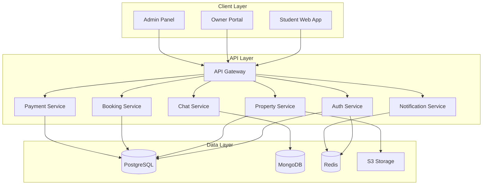

# SafeStay Platform - Technical Implementation Plan

## Overview

SafeStay is a two-sided marketplace platform connecting Egyptian students with verified housing near universities. This plan outlines the technical architecture, technology stack, database design, and implementation roadmap for the MVP.

## Technology Stack

### Frontend
- **Framework**: Next.js 14 (App Router) with React 18
- **Language**: TypeScript
- **Styling**: Tailwind CSS
- **State Management**: Zustand + React Query
- **Form Handling**: React Hook Form + Zod validation
- **Maps**: Leaflet or Google Maps API
- **i18n**: next-i18next (Arabic + English)

### Backend
- **Runtime**: Node.js 20+
- **Framework**: Express.js with TypeScript
- **API Design**: RESTful + GraphQL (optional for complex queries)
- **Authentication**: JWT + Refresh Tokens
- **Validation**: Zod
- **ORM**: Prisma (PostgreSQL) + Mongoose (MongoDB)

### Databases
- **Primary**: PostgreSQL 15 (users, properties, bookings, payments)
- **Secondary**: MongoDB (chat messages, activity logs)
- **Cache**: Redis (sessions, rate limiting, caching)

### Infrastructure
- **Containerization**: Docker + Docker Compose
- **File Storage**: AWS S3 or Cloudinary
- **Payment**: PayMob + Stripe
- **SMS/OTP**: Twilio or local Egyptian provider
- **Real-time**: Socket.io
- **Search**: ElasticSearch (future enhancement)

### DevOps
- **Version Control**: Git
- **CI/CD**: GitHub Actions
- **Hosting**: AWS/DigitalOcean/Railway
- **Monitoring**: Sentry (errors) + Winston (logging)

---

## System Architecture

### Monorepo Structure
```
safestay/
├── apps/
│   ├── web/                 # Student-facing Next.js app
│   ├── owner-portal/        # Property owner Next.js app
│   ├── admin-panel/         # Admin dashboard
│   └── api/                 # Express.js backend
├── packages/
│   ├── ui/                  # Shared React components
│   ├── database/            # Prisma + Mongoose schemas
│   ├── types/               # Shared TypeScript types
│   ├── utils/               # Shared utilities
│   └── config/              # Shared configurations
├── docker/
│   ├── postgres/
│   ├── mongodb/
│   ├── redis/
│   └── nginx/
├── docker-compose.yml
└── package.json
```

### Service Architecture



---

## Database Schema Design

### PostgreSQL Schema (Primary Database)

#### Core Tables

**users**
- id (UUID, PK)
- email (unique)
- phone (unique)
- password_hash
- role (ENUM: student, owner, admin)
- first_name
- last_name
- avatar_url
- is_verified
- is_active
- created_at
- updated_at

**student_profiles**
- id (UUID, PK)
- user_id (FK → users.id)
- university
- student_id
- student_id_verified
- gender (ENUM: male, female, prefer_not_to_say)
- date_of_birth
- preferences (JSONB: budget_min, budget_max, preferred_areas, etc.)
- parent_id (FK → parent_profiles.id)

**parent_profiles**
- id (UUID, PK)
- user_id (FK → users.id)
- relation_to_student (ENUM: father, mother, guardian)
- linked_students (ARRAY of UUIDs)

**owner_profiles**
- id (UUID, PK)
- user_id (FK → users.id)
- owner_type (ENUM: individual, company)
- national_id
- national_id_verified
- business_license (nullable)
- business_license_verified
- bank_account_number
- bank_name
- tax_id

**properties**
- id (UUID, PK)
- owner_id (FK → owner_profiles.id)
- title (varchar 200)
- description (text)
- property_type (ENUM: apartment, room, shared_room, studio)
- address (text)
- governorate
- city
- district
- latitude (decimal)
- longitude (decimal)
- price_per_month (decimal)
- deposit_amount (decimal)
- available_from (date)
- is_available (boolean)
- gender_restriction (ENUM: male_only, female_only, mixed)
- max_occupants (int)
- bedrooms (int)
- bathrooms (int)
- amenities (JSONB array)
- house_rules (text)
- verification_status (ENUM: pending, approved, rejected)
- verification_notes (text)
- created_at
- updated_at

**property_images**
- id (UUID, PK)
- property_id (FK → properties.id)
- image_url
- is_primary (boolean)
- display_order (int)
- uploaded_at

**universities**
- id (UUID, PK)
- name
- governorate
- city
- latitude
- longitude
- created_at

**property_distances**
- id (UUID, PK)
- property_id (FK → properties.id)
- university_id (FK → universities.id)
- distance_km (decimal)
- commute_time_minutes (int)

**bookings**
- id (UUID, PK)
- property_id (FK → properties.id)
- student_id (FK → student_profiles.id)
- status (ENUM: pending, approved, rejected, active, completed, cancelled)
- start_date
- end_date
- monthly_rent (decimal)
- deposit_amount (decimal)
- total_amount (decimal)
- contract_url (nullable)
- signed_by_student_at (nullable)
- signed_by_owner_at (nullable)
- signed_by_parent_at (nullable)
- created_at
- updated_at

**payments**
- id (UUID, PK)
- booking_id (FK → bookings.id)
- payer_id (FK → users.id)
- payment_type (ENUM: deposit, rent, commission, refund)
- amount (decimal)
- currency (default: EGP)
- status (ENUM: pending, processing, completed, failed, refunded)
- payment_method (ENUM: card, bank_transfer, cash)
- payment_gateway (ENUM: paymob, stripe, manual)
- transaction_id (unique)
- escrow_status (ENUM: held, released, refunded)
- due_date (nullable)
- paid_at (nullable)
- created_at
- updated_at

**reviews**
- id (UUID, PK)
- property_id (FK → properties.id)
- student_id (FK → student_profiles.id)
- booking_id (FK → bookings.id)
- rating (int 1-5)
- cleanliness_rating (int 1-5)
- location_rating (int 1-5)
- value_rating (int 1-5)
- communication_rating (int 1-5)
- comment (text)
- is_verified (boolean)
- created_at
- updated_at

**disputes**
- id (UUID, PK)
- booking_id (FK → bookings.id)
- raised_by (FK → users.id)
- dispute_type (ENUM: payment, property_condition, contract_breach, harassment, other)
- description (text)
- status (ENUM: open, investigating, resolved, closed)
- resolved_by (FK → users.id, nullable)
- resolution_notes (text)
- created_at
- resolved_at
- updated_at

**notifications**
- id (UUID, PK)
- user_id (FK → users.id)
- type (ENUM: booking_update, payment_reminder, message, verification, etc.)
- title
- message
- data (JSONB)
- is_read (boolean)
- created_at

**verification_requests**
- id (UUID, PK)
- user_id (FK → users.id)
- verification_type (ENUM: student_id, national_id, property, bank_account)
- document_urls (JSONB array)
- status (ENUM: pending, approved, rejected)
- reviewed_by (FK → users.id, nullable)
- rejection_reason (text, nullable)
- submitted_at
- reviewed_at

### MongoDB Collections (Secondary Database)

**chat_messages**
```javascript
{
  _id: ObjectId,
  conversation_id: String,
  sender_id: String (UUID),
  recipient_id: String (UUID),
  message: String,
  message_type: "text" | "image" | "file",
  attachments: [{ url: String, type: String }],
  is_read: Boolean,
  created_at: Date
}
```

**activity_logs**
```javascript
{
  _id: ObjectId,
  user_id: String (UUID),
  action: String,
  entity_type: String,
  entity_id: String,
  metadata: Object,
  ip_address: String,
  user_agent: String,
  created_at: Date
}
```

**search_history**
```javascript
{
  _id: ObjectId,
  user_id: String (UUID),
  search_query: String,
  filters: Object,
  results_count: Number,
  created_at: Date
}
```

---

## API Design

### Authentication Endpoints

```
POST   /api/auth/register              # Register new user
POST   /api/auth/login                 # Login
POST   /api/auth/logout                # Logout
POST   /api/auth/refresh               # Refresh access token
POST   /api/auth/verify-email          # Verify email
POST   /api/auth/verify-phone          # Verify phone (OTP)
POST   /api/auth/forgot-password       # Request password reset
POST   /api/auth/reset-password        # Reset password
```

### Student Endpoints

```
GET    /api/students/profile           # Get student profile
PUT    /api/students/profile           # Update student profile
POST   /api/students/preferences       # Update search preferences
GET    /api/students/bookings          # List student bookings
POST   /api/students/verify            # Submit student ID for verification
```

### Property Endpoints

```
GET    /api/properties                 # Search properties (with filters)
GET    /api/properties/:id             # Get property details
POST   /api/properties                 # Create property (owner)
PUT    /api/properties/:id             # Update property (owner)
DELETE /api/properties/:id             # Delete property (owner)
GET    /api/properties/:id/reviews     # Get property reviews
POST   /api/properties/:id/favorite    # Add to favorites
```

### Booking Endpoints

```
POST   /api/bookings                   # Create booking request
GET    /api/bookings/:id               # Get booking details
PUT    /api/bookings/:id/approve       # Approve booking (owner)
PUT    /api/bookings/:id/reject        # Reject booking (owner)
PUT    /api/bookings/:id/cancel        # Cancel booking
PUT    /api/bookings/:id/sign          # Sign contract
```

### Payment Endpoints

```
GET    /api/payments                   # List payments
POST   /api/payments                   # Create payment
GET    /api/payments/:id               # Get payment details
POST   /api/payments/:id/process       # Process payment
POST   /api/payments/:id/refund        # Request refund
```

### Review Endpoints

```
POST   /api/reviews                    # Create review
GET    /api/reviews/:id                # Get review
PUT    /api/reviews/:id                # Update review
DELETE /api/reviews/:id                # Delete review
```

### Chat Endpoints

```
GET    /api/chat/conversations         # List conversations
GET    /api/chat/conversations/:id     # Get conversation messages
POST   /api/chat/messages              # Send message
PUT    /api/chat/messages/:id/read     # Mark as read
```

### Admin Endpoints

```
GET    /api/admin/verifications        # List pending verifications
PUT    /api/admin/verifications/:id    # Approve/reject verification
GET    /api/admin/disputes             # List disputes
PUT    /api/admin/disputes/:id         # Update dispute status
GET    /api/admin/analytics            # Get platform analytics
```

---

## Security Considerations

### Authentication & Authorization
- JWT-based authentication with refresh tokens
- Role-based access control (RBAC)
- Row-level security for multi-tenant data
- OTP verification for phone numbers
- Email verification required

### Data Protection
- Passwords hashed with bcrypt (12 rounds)
- Sensitive data encrypted at rest
- TLS/SSL for all communications
- PCI DSS compliance for payment data
- GDPR-like privacy controls

### API Security
- Rate limiting (Redis-based)
- CORS configuration
- Request validation (Zod)
- SQL injection prevention (Prisma ORM)
- XSS protection
- CSRF tokens for state-changing operations

### File Upload Security
- File type validation
- File size limits
- Virus scanning (optional)
- Signed URLs for private files
- CDN for public assets

---

## Development Phases

### Phase 1: Foundation (Weeks 1-2)
- [ ] Set up monorepo structure
- [ ] Configure development environment
- [ ] Set up databases (PostgreSQL, MongoDB, Redis)
- [ ] Implement authentication service
- [ ] Create base UI components

### Phase 2: Core Features (Weeks 3-6)
- [ ] Property listing and search
- [ ] User profiles (student, owner)
- [ ] Property details page
- [ ] Image upload and storage
- [ ] Basic booking flow

### Phase 3: Payments & Contracts (Weeks 7-9)
- [ ] Payment integration (PayMob)
- [ ] Escrow system
- [ ] Contract generation
- [ ] E-signature integration
- [ ] Payment dashboard

### Phase 4: Trust & Safety (Weeks 10-12)
- [ ] Admin verification dashboard
- [ ] KYC workflows
- [ ] Review and rating system
- [ ] Dispute management
- [ ] Fraud detection basics

### Phase 5: Communication (Weeks 13-14)
- [ ] Real-time chat (Socket.io)
- [ ] Notifications system
- [ ] WhatsApp integration
- [ ] Email templates
- [ ] SMS notifications

### Phase 6: Testing & Polish (Weeks 15-16)
- [ ] Unit testing
- [ ] Integration testing
- [ ] E2E testing
- [ ] Performance optimization
- [ ] Security audit
- [ ] Bug fixes

### Phase 7: Deployment (Week 17-18)
- [ ] Production environment setup
- [ ] CI/CD pipeline
- [ ] Monitoring and logging
- [ ] Backup strategy
- [ ] Launch preparation

---

## Key Features Prioritization (MoSCoW)

### Must Have (MVP)
- User registration and authentication
- Property search and filtering
- Property details with images
- Booking request flow
- Basic payment integration
- Simple contract generation
- Admin verification dashboard
- Reviews and ratings

### Should Have
- Real-time chat
- Advanced search filters
- Payment escrow
- Parent dashboard
- E-signature
- Email/SMS notifications
- Roommate matching

### Could Have
- Virtual 360° tours
- Mobile apps
- Advanced analytics
- AI recommendations
- University integrations
- Professional photography booking

### Won't Have (Initial Release)
- Social features
- Gamification
- Multi-language beyond Arabic/English
- Blockchain-based contracts
- Cryptocurrency payments

---

## Performance Targets

- Page load time: < 2 seconds
- API response time: < 200ms (p95)
- Database query time: < 100ms (p95)
- Image load time: < 1 second
- Uptime: 99.9%
- Concurrent users: 10,000+

---

## Monitoring & Observability

- **Error Tracking**: Sentry
- **Logging**: Winston + CloudWatch/Datadog
- **APM**: New Relic or Datadog
- **Uptime Monitoring**: Pingdom or UptimeRobot
- **Analytics**: Google Analytics + Mixpanel

---

## Risk Mitigation

### Technical Risks
- **Payment integration complexity**: Start with one provider, expand later
- **Scalability**: Design with horizontal scaling in mind
- **Data consistency**: Use database transactions for critical operations

### Business Risks
- **Two-sided marketplace growth**: Launch with pre-verified properties
- **Trust and safety**: Invest heavily in verification from day one
- **Legal compliance**: Partner with legal experts for contracts

---

## Next Steps

1. Review and approve this implementation plan
2. Set up development environment and project structure
3. Create detailed database migrations
4. Design key UI wireframes
5. Begin Phase 1 development
